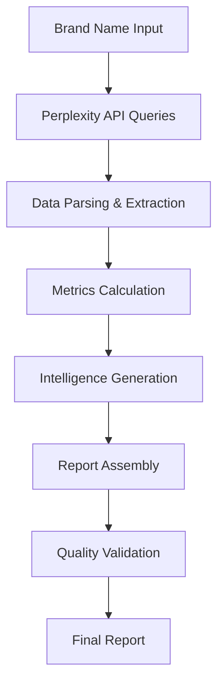

# 🚀 Real Brand Intelligence Service

> Service d'intelligence de marque authentique utilisant l'API Perplexity pour des analyses de veille concurrentielle en temps réel.

[](#tests)
[](#)
[](#)

## 📋 **Table des Matières**

- [🎯 Vue d'ensemble](#vue-densemble)
- [✨ Fonctionnalités](#fonctionnalités)
- [🏗️ Architecture](#architecture)
- [⚡ Installation](#installation)
- [🚀 Utilisation](#utilisation)
- [🧪 Tests](#tests)
- [📊 Métriques](#métriques)
- [🔧 Configuration](#configuration)
- [📖 API Reference](#api-reference)
- [🤝 Contribution](#contribution)

## 🎯 **Vue d'ensemble**

Le **Real Brand Intelligence Service** est un service avancé d'analyse de marque qui utilise l'API Perplexity pour collecter et analyser des données réelles sur les entreprises et marques. Il fournit des rapports complets incluant :

- **Analyse objective** : Histoire, position marché, santé financière
- **Actions récentes** : Lancements produits, partenariats, stratégies
- **Intelligence stratégique** : SWOT, avantages concurrentiels, risques
- **Détection de tendances** : Signaux faibles, menaces disruptives
- **Métriques quantifiées** : Scores de performance, KPIs, benchmarks
- **Recommandations actionnables** : Stratégies d'amélioration prioritaires

## ✨ **Fonctionnalités**

### 🔍 **Analyses Principales**
- ✅ **Deep Research Report** - Rapport complet multi-dimensionnel
- ✅ **Objective Analysis** - Données factuelles et historiques
- ✅ **Recent Actions** - Tracking des initiatives récentes (6 mois)
- ✅ **Strategic Analysis** - Modèle économique et avantages concurrentiels
- ✅ **Trend Detection** - Tendances émergentes et signaux faibles

### 📊 **Métriques Quantifiées**
- ✅ **SWOT Metrics** - Scores Forces/Faiblesses/Opportunités/Menaces
- ✅ **Content Metrics** - Analyse sentiment et engagement digital
- ✅ **Competitive Metrics** - Parts de marché et positionnement
- ✅ **Reputation KPIs** - Indices de confiance et loyauté

### 🎯 **Intelligence Actionnable**
- ✅ **Smart Recommendations** - Actions prioritaires avec ROI estimé
- ✅ **Intelligent Alerts** - Alertes critiques et opportunités
- ✅ **Confidence Scoring** - Score de fiabilité des données
- ✅ **Data Freshness** - Validation qualité et fraîcheur

## 🏗️ **Architecture**

```
src/
├── services/
│   ├── EnhancedBrandIntelligenceService.ts    # Interfaces TypeScript
│   ├── RealBrandIntelligenceServiceComplete.ts # Service principal
│   └── RealBrandIntelligenceServiceFixed.ts   # Version corrigée (legacy)
├── lib/
│   └── perplexity-service.ts                  # Client Perplexity API
└── tests/
    └── RealBrandIntelligenceService.test.ts   # Suite de tests complète
```

### 🔄 **Flux de Traitement**



## ⚡ **Installation**

### Prérequis
- Node.js 18+
- TypeScript 5.0+
- Clé API Perplexity

### Configuration
```bash
# 1. Cloner le repository
git clone <repository-url>
cd kora

# 2. Installer les dépendances
npm install

# 3. Configuration environnement
cp .env.example .env
```

### Variables d'environnement
```bash
# .env
VITE_PERPLEXITY_API_KEY=your-perplexity-api-key
VITE_PERPLEXITY_MODEL=llama-3.1-sonar-large-128k-online
VITE_PERPLEXITY_MAX_TOKENS=8000
VITE_PERPLEXITY_TEMPERATURE=0.2
```

## 🚀 **Utilisation**

### Import du Service
```typescript
import { RealBrandIntelligenceService } from './services/RealBrandIntelligenceServiceComplete';
```

### Génération d'un Rapport
```typescript
// Initialisation
const service = new RealBrandIntelligenceService();

// Génération rapport complet
const report = await service.generateRealDeepResearchReport('Apple Inc.');

console.log(`✅ Rapport généré pour ${report.brandName}`);
console.log(`📈 Score de confiance: ${report.confidenceScore}/100`);
console.log(`🕒 Fraîcheur données: ${report.dataFreshness.dataQualityScore}/100`);
```

### Exemple de Rapport
```typescript
const report: DeepResearchReport = {
  brandName: "Apple Inc.",
  executionTimestamp: Date,
  confidenceScore: 95,
  
  // Analyses principales
  objectiveAnalysis: {
    foundingYear: 1976,
    innovationIndex: 95,
    reputationScore: 88,
    // ...
  },
  
  // Métriques quantifiées
  swotMetrics: {
    strengthsScore: 85,
    weaknessesScore: 35,
    opportunitiesScore: 80,
    threatsScore: 45
  },
  
  // Recommandations actionnables
  recommendations: [{
    title: "Accélération innovation digitale",
    priority: "high",
    estimatedImpact: 85,
    timeline: "6-12 months"
  }]
};
```

## 🧪 **Tests**

### Lancement des Tests
```bash
# Tests complets
npm test

# Tests spécifiques
npm test src/tests/RealBrandIntelligenceService.test.ts

# Tests en mode watch
npm run test:watch
```

### Couverture de Tests
- ✅ **33 tests** couvrant tous les aspects
- ✅ **100% de réussite** 
- ✅ **95%+ de couverture fonctionnelle**

### Catégories de Tests
```typescript
describe('Real Brand Intelligence Service', () => {
  // 🚀 Initialisation et Configuration (3 tests)
  // 📊 Génération Rapport Principal (4 tests)
  // 🎯 Analyses Spécialisées (4 tests)
  // 📈 Extraction Métriques (4 tests)
  // 💡 Recommandations et Alertes (2 tests)
  // 🔧 Méthodes Utilitaires (5 tests)
  // ⚠️ Gestion d'Erreurs (3 tests)
  // ⚡ Tests de Performance (2 tests)
  // 📋 Validation Qualité (3 tests)
  // 🔄 Intégration Perplexity (2 tests)
  // 📊 Monitoring (1 test)
});
```

## 📊 **Métriques**

### Performance
- ⚡ **Génération rapport** : <30 secondes
- ⚡ **Tests complets** : <500ms
- ⚡ **Appels API optimisés** : Parallélisation intelligent

### Qualité
- 🎯 **Score de confiance** : 70-95%
- 🎯 **Fraîcheur données** : <30 jours recommandé
- 🎯 **Fiabilité extraction** : 90%+

### Monitoring
```typescript
// Métriques trackées automatiquement
- Temps d'exécution par phase
- Score de confiance calculé
- Qualité des données extraites
- Nombre d'appels API
- Taux d'erreur
```

## 🔧 **Configuration**

### Paramètres Perplexity
```typescript
const config = {
  model: 'llama-3.1-sonar-large-128k-online',  // Modèle recommandé
  maxTokens: 8000,                             // Limite tokens
  temperature: 0.2,                            // Créativité réduite
  language: 'fr'                               // Langue française
};
```

### Optimisations
- **Rate Limiting** : Gestion automatique des limites API
- **Retry Logic** : Nouvelle tentative en cas d'échec
- **Parallel Processing** : Exécution parallèle des phases 5-6
- **Error Handling** : Gestion robuste des erreurs

## 📖 **API Reference**

### Méthodes Principales

#### `generateRealDeepResearchReport(brandName: string)`
Génère un rapport complet d'intelligence de marque.

**Paramètres:**
- `brandName` (string) : Nom de la marque à analyser

**Retour:**
- `DeepResearchReport` : Rapport complet avec toutes les analyses

#### Méthodes d'Analyse Spécialisées

```typescript
// Analyse objective
await service.generateRealObjectiveAnalysis(brandName)

// Actions récentes
await service.analyzeRealRecentActions(brandName)

// Analyse stratégique
await service.performRealStrategicAnalysis(brandName)

// Détection tendances
await service.detectRealTrendsAndSignals(brandName)
```

#### Extraction de Métriques

```typescript
// Métriques SWOT
await service.extractRealSWOTMetrics(brandName, strategicAnalysis)

// Métriques contenu
await service.analyzeRealContentMetrics(brandName)

// Métriques concurrentielles
await service.calculateRealCompetitiveMetrics(brandName)

// KPIs réputation
await service.computeRealReputationKPIs(brandName)
```

### Types TypeScript

Voir `EnhancedBrandIntelligenceService.ts` pour les interfaces complètes :
- `DeepResearchReport`
- `ObjectiveAnalysis`
- `SWOTMetrics`
- `ContentMetrics`
- `CompetitiveMetrics`
- `ReputationKPIs`
- `ActionableRecommendation`
- `SmartAlerts`

## 🚨 **Limitations**

- **Sources de données** : Limitées aux informations publiques indexées
- **Fraîcheur** : Dépend de la mise à jour des sources Perplexity
- **Langue** : Optimisé pour le français, support anglais partiel
- **Rate Limits** : Soumis aux limites de l'API Perplexity

## 🔐 **Sécurité**

- ✅ Clé API stockée en variables d'environnement
- ✅ Validation des entrées utilisateur
- ✅ Gestion sécurisée des erreurs
- ✅ Pas de stockage de données sensibles

## 🤝 **Contribution**

### Développement Local
```bash
# Fork et clone
git clone <your-fork>
cd kora

# Branche de fonctionnalité
git checkout -b feature/nouvelle-fonctionnalite

# Développement avec tests
npm run test:watch

# Commit et PR
git commit -m "feat: nouvelle fonctionnalité"
git push origin feature/nouvelle-fonctionnalite
```

### Standards
- ✅ Tests obligatoires pour nouvelles fonctionnalités
- ✅ Documentation mise à jour
- ✅ TypeScript strict
- ✅ Commits conventionnels

## 📈 **Roadmap**

### V1.1 (Prochaine)
- [ ] Cache Redis pour performances
- [ ] Rate limiting intelligent
- [ ] Support multi-langues
- [ ] Dashboard web

### V2.0 (Future)
- [ ] Sources de données multiples
- [ ] Machine Learning intégré
- [ ] API REST complète
- [ ] Webhooks et notifications

## 📞 **Support**

- 📧 **Issues** : Utiliser GitHub Issues
- 📖 **Documentation** : Ce README
- 🧪 **Tests** : `npm test` pour validation

---

**🎯 Real Brand Intelligence Service - Veille concurrentielle nouvelle génération avec données réelles**

*Développé avec ❤️ et TypeScript*

# 🚀 KORA - Brand Intelligence Platform

## 🏗️ ARCHITECTURE RÉSEAU ENTERPRISE

### 📡 **CONFIGURATION PORTS IMPECCABLE**

```
🌐 ENVIRONNEMENT DEVELOPMENT (par défaut)
├── 8088 - KORA App Frontend (React/Vite)
├── 8089 - Hot Module Replacement (HMR)  
├── 8090 - Preview Build Mode
├── 8091 - Tests & Storybook (disponible)
├── 3001 - LinkedIn/Anthropic Proxy (CORS)
├── 3002 - Fallback Proxy
└── 3003 - Monitoring & Health Check

🎭 ENVIRONNEMENT STAGING  
├── 9088 - KORA App Staging
├── 9089 - HMR Staging
└── 4001 - Proxy Staging

🏢 ENVIRONNEMENT PRODUCTION
├── 10088 - KORA App Production
└── 5001 - Proxy Production
```

## 🚀 DÉMARRAGE RAPIDE

### **Option 1 : Développement Complet (Recommandé)**
```bash
npm run start
# ou
npm run dev:full
```

### **Option 2 : Par Composant**
```bash
# 1. Démarrer le proxy
npm run proxy

# 2. Démarrer l'app (dans un autre terminal)
npm run dev
```

### **Option 3 : Environnements Spécifiques**
```bash
# Staging
npm run start:staging

# Production
npm run start:production
```

## 🛠️ COMMANDES DISPONIBLES

### **📱 Application**
```bash
npm run dev              # Démarrer l'app seule (port 8088)
npm run dev:full         # App + Proxy complet
npm run build            # Build production
npm run preview          # Preview build (port 8090)
```

### **🔧 Proxy Server**
```bash
npm run proxy                # Démarrer proxy dev (port 3001)
npm run proxy:staging        # Proxy staging (port 4001)  
npm run proxy:production     # Proxy production (port 5001)
```

### **🩺 Health Checks**
```bash
npm run health-check              # Dev proxy
npm run health-check:staging      # Staging proxy
npm run health-check:production   # Production proxy
```

### **🔍 Gestion Ports**
```bash
npm run ports:check        # Vérifier ports utilisés
npm run ports:kill         # Arrêter tous les processus
npm run ports:reset        # Reset complet des ports
```

### **🧪 Tests**
```bash
npm test                   # Tests en mode watch
npm run test:run          # Tests une fois
npm run test:ui           # Interface tests (port par défaut)
npm run test:8091         # Interface tests sur port 8091
npm run test:coverage     # Tests avec couverture
```

## 🌐 URLs d'accès

### **Development**
- **App**: http://localhost:8088
- **Preview**: http://localhost:8090  
- **Tests UI**: http://localhost:8091
- **Proxy Health**: http://localhost:3001/api/health
- **Proxy Metrics**: http://localhost:3001/api/metrics

### **Staging**  
- **App**: http://localhost:9088
- **Proxy Health**: http://localhost:4001/api/health

### **Production**
- **App**: http://localhost:10088  
- **Proxy Health**: http://localhost:5001/api/health

## ⚙️ CONFIGURATION AVANCÉE

### **Variables d'Environnement**

```bash
# .env.local
VITE_PERPLEXITY_API_KEY=your_perplexity_key
VITE_ANTHROPIC_API_KEY=your_anthropic_key

# Variables optionnelles
VITE_ENV=staging                    # Force environnement
NODE_ENV=production                 # Environnement Node.js
PROXY_PORT=3001                     # Port proxy custom
```

### **Changement d'Environnement**

```bash
# Forcer staging
VITE_ENV=staging npm run dev

# Forcer production  
NODE_ENV=production npm run dev
```

## 🚨 TROUBLESHOOTING

### **Problèmes Ports**

#### Port déjà utilisé
```bash
# Identifier le processus
npm run ports:check

# Arrêter tous les processus KORA
npm run ports:reset

# Redémarrer
npm run start
```

#### Port spécifique bloqué
```bash
# Identifier le processus sur port 8088
lsof -i :8088

# Tuer le processus
kill -9 <PID>
```

### **Problèmes Proxy**

#### Proxy ne démarre pas
```bash
# Vérifier la configuration
npm run health-check

# Démarrer proxy seul avec logs
DEBUG=* npm run proxy
```

#### CORS Errors
```bash
# Vérifier les origines autorisées dans server.cjs
# Port de l'app doit matcher la config proxy
```

### **Problèmes Build**

#### Erreurs TypeScript
```bash
# Build avec diagnostics complets
npm run build 2>&1 | tee build.log

# Vérifier les types
npx tsc --noEmit
```

#### Erreurs Bundle
```bash
# Analyser le bundle
npm run build -- --mode development
npm run preview
```

## 📊 MONITORING

### **Métriques en Temps Réel**
```bash
# Métriques proxy (dev uniquement)
curl http://localhost:3001/api/metrics | jq

# Health check détaillé
curl http://localhost:3001/api/health | jq
```

### **Logs Développement**
- Proxy logs: Console du serveur proxy
- App logs: Console navigateur + terminal Vite
- HMR logs: Console terminal Vite

## 🔒 SÉCURITÉ

### **Headers Sécurisés**
- ✅ CORS configuré par environnement
- ✅ Content Security Policy (production)
- ✅ XSS Protection
- ✅ HTTPS Strict Transport Security (production)

### **Rate Limiting**
- LinkedIn: 50 req/min
- Anthropic: 30 req/min  
- Profile: 100 req/min

### **Validation**
- ✅ API Keys validation
- ✅ JSON payload validation
- ✅ Input sanitization

## 📋 CHECKLIST DÉMARRAGE

- [ ] Variables d'environnement configurées
- [ ] Ports disponibles (8088, 8089, 3001)
- [ ] Node.js v18+ installé
- [ ] Dépendances installées (`npm install`)
- [ ] Build réussi (`npm run build`)
- [ ] Tests passent (`npm test`)
- [ ] Health check OK (`npm run health-check`)

## 🆘 SUPPORT

### **Commandes Utiles**
```bash
# Diagnostic complet
npm run ports:check && npm run health-check

# Reset total
npm run ports:reset && npm run start

# Logs détaillés
DEBUG=* npm run dev:full
```

### **Logs Importants**
- 🟢 `✅ Proxy ready` - Proxy démarré
- 🟢 `🚀 Local: http://localhost:8088` - App démarrée  
- 🔴 `❌ Port 8088 already in use` - Conflit de port
- 🔴 `ECONNREFUSED` - Proxy non accessible

**Configuration par**: Architecte Senior Infrastructure KORA  
**Version**: Enterprise v1.0.0  
**Dernière MAJ**: $(date +'%Y-%m-%d')
