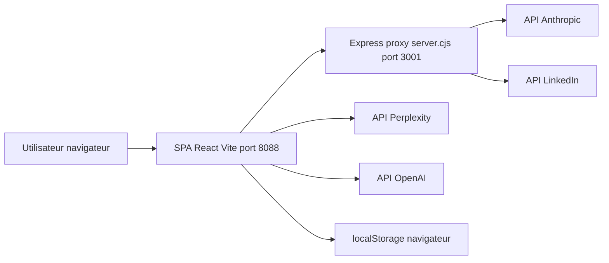

# Architecture

Document de référence de l'architecture technique de Kora Digital Pilot.

## 1. Vue d'ensemble

Kora Digital Pilot est une plateforme interne de communication digitale et de brand intelligence éditée par Korev AI. L'application est une Single Page Application (SPA) React, accompagnée d'un proxy Node/Express léger pour les appels sortants nécessitant un secret serveur (LinkedIn, Anthropic).

## 2. Stack technique

| Couche | Technologie | Version cible |
| --- | --- | --- |
| Build / bundler | Vite | 5.x |
| Framework UI | React | 18.x |
| Langage | TypeScript | ~5.6 |
| Styling | Tailwind CSS + shadcn/ui (Radix UI) | Tailwind 3.4 |
| Routing | React Router DOM | 6.x |
| State / data | React Query (TanStack) | 5.x |
| Validation | Zod, React Hook Form | – |
| Export | jsPDF, recharts | – |
| Proxy serveur | Node.js + Express + node-fetch | Node 20+, Express 4.21 |
| Tests | Vitest + Testing Library + jsdom | Vitest 2.x |

Le projet n'embarque pas de base de données serveur. Toute la persistance applicative se fait côté client via `localStorage`.

## 3. Flux principal

Justifications :

- Les appels Perplexity et OpenAI partent directement du navigateur avec une clé `VITE_*` exposée au bundle. C'est une dette de sécurité connue (voir `SECURITY.md`).
- Les appels LinkedIn et Anthropic transitent par le proxy car ils requièrent un secret serveur (client secret OAuth, clé Anthropic non destinée au bundle).
- `localStorage` joue le rôle de mémoire applicative (tokens, planning, historique d'exports, paramètres anti-spam).

## 4. Routes applicatives

Définies dans `src/App.tsx` :

| Route | Composant | Rôle |
| --- | --- | --- |
| `/` | `Landing` | Page d'accueil publique |
| `/app` | `Index` | Coque applicative (sidebar + 10 sections) |
| `/settings` | `Settings` | Configuration des clés API et préférences |
| `/test-api` | `TestAPI` | Banc de test des intégrations |
| `/diagnostic` | `DiagnosticTest` | Diagnostic des connecteurs |
| `/auth/linkedin/callback` | `LinkedInCallback` | Callback OAuth LinkedIn |
| `*` | `NotFound` | 404 |

Les 10 sections internes de `/app` sont sélectionnées via l'état `activeSection` du composant `Index` :

`dashboard`, `cm-dashboard`, `cm-domain-search`, `brand-monitoring`, `brand-intelligence-tdd`, `inspiration`, `images`, `planning`, `analytics`, `library`.

## 5. Modules majeurs

| Dossier | Rôle | Points notables |
| --- | --- | --- |
| `src/services/` | Logique métier orchestrée | `RealBrandIntelligenceService.ts` (≈2300 lignes), orchestrateur, services d'export et d'intégration |
| `src/services/core/`, `src/services/brand/`, `src/services/export/`, `src/services/integration/` | Sous-domaines métier | Découpage thématique des services |
| `src/lib/` | Couches techniques transverses | `perplexity-service.ts`, `linkedin-api.ts`, `ai-service.ts`, `global-api-blocker.ts`, `pdf-exporter.ts`, `planning-service.ts`, `logger.ts` |
| `src/hooks/` | Hooks React métier | `usePerplexity`, `useLinkedInAnalytics`, `useLinkedInStats`, `useBusinessIntelligence`, `useAI`, `useHybridAI`, `usePlanning` |
| `src/components/` | Composants UI | Dashboards (`Dashboard`, `Analytics`, `Library`, `Planning`, `BrandMonitoring`, `CommunityManagerDashboard`, `CommunityManagerDomainDashboard`, `InspirationAI`, `ImageGenerator`), widgets de monitoring API, intégration LinkedIn |
| `src/components/enhanced/` | Variants enrichis | `BrandIntelligenceDashboard.tsx` (≈1200 lignes) |
| `src/components/ui/` | Primitives shadcn/ui | Boutons, dialogs, inputs, etc. |
| `src/pages/` | Pages racines des routes | `Index`, `Landing`, `Settings`, `NotFound` |
| `src/types/` | Types TypeScript métier | `BrandIntelligenceTypes.ts`, `brand-analysis.ts` |
| `src/tests/`, `src/test/` | Tests Vitest | ≈27 fichiers de tests |
| `server.cjs` | Proxy Express | Endpoints `/api/linkedin/*`, `/api/anthropic/messages`, `/api/health`, `/api/metrics` |

## 6. Endpoints du proxy

Définis dans `server.cjs` :

| Méthode | Endpoint | Rôle |
| --- | --- | --- |
| `POST` | `/api/linkedin/token` | Échange code OAuth contre access token |
| `POST` | `/api/linkedin/profile` | Récupération de profil LinkedIn |
| `POST` | `/api/anthropic/messages` | Forward authentifié vers Anthropic |
| `GET` | `/api/health` | Liveness probe du proxy |
| `GET` | `/api/metrics` | Métriques internes (développement) |

Le proxy n'expose pas d'authentification applicative : il est destiné à un usage local ou interne derrière un réseau privé (voir `SECURITY.md`).

## 7. Décisions d'architecture

- **Pas de base de données serveur.** La plateforme est aujourd'hui orientée poste de travail, sans synchronisation multi-utilisateurs. Toute persistance vit dans le navigateur (`localStorage`). Choix assumé pour limiter la surface d'infrastructure ; à revoir en cas de passage multi-utilisateurs.
- **Bundle exposé.** Les variables `VITE_*` sont injectées dans le bundle JavaScript livré au navigateur. Toute clé d'API placée dans `VITE_*` est donc considérée comme publique. C'est intentionnel pour Perplexity et OpenAI (clés à usage limité, rotation possible) et explicite pour LinkedIn `CLIENT_ID` ; le LinkedIn `CLIENT_SECRET` et la clé Anthropic restent côté proxy.
- **Proxy minimal.** Pas de cache serveur, pas de file d'attente, pas d'auth utilisateur. Le proxy se borne à proxifier, ajouter les en-têtes d'API et appliquer un rate limiting par fenêtre courte.
- **Protection anti-spam côté client.** Un blocker global (`src/lib/global-api-blocker.ts`) et un détecteur d'état serveur (`src/lib/server-detection.ts`) limitent les appels en cas d'incident afin de protéger les crédits Perplexity.
- **TDD partielle.** Plusieurs modules sont sous test (services Brand Intelligence, export production). D'autres (UI Analytics, Dashboard) embarquent encore des métriques d'illustration non branchées sur une source réelle (voir `DATA_MODEL.md`).

## 8. Build et exécution

- Application en mode développement : `npm run dev:full` (concurrently `proxy` + `vite`).
- Build de production statique : `npm run build` produit `dist/` (Vite + `tsc -b`).
- Préversion locale du build : `npm run preview`.

Voir `OPERATIONS.md` pour le détail.

---

Dernière mise à jour : 2026-05-21.
