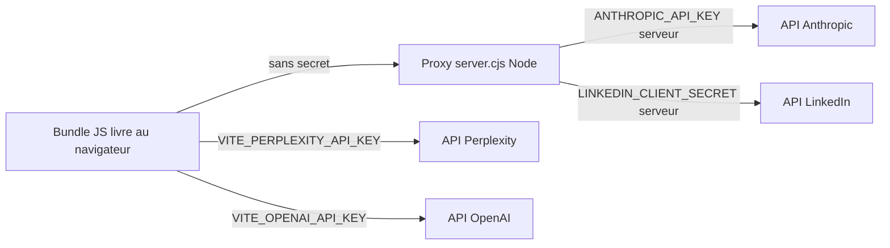

# Sécurité

Document de référence sur la sécurité de Kora Digital Pilot. Décrit le modèle de menaces, la gestion des secrets, les risques résiduels assumés et la procédure de rotation.

## 1. Modèle de menaces

Périmètre actuel : application interne déployée en local sur les postes des collaborateurs Korev AI, ou sur un serveur privé interne. Le proxy Express n'expose pas d'authentification utilisateur et n'est pas destiné à être publié sur internet en l'état.

| Menace | Exposition actuelle | Mitigation |
| --- | --- | --- |
| Fuite de clés d'API tierces (Perplexity, OpenAI) | Élevée — clés `VITE_*` embarquées dans le bundle JS livré au navigateur | Rotation régulière, plafond budgétaire chez le fournisseur, blocker anti-spam |
| Fuite du client secret LinkedIn ou de la clé Anthropic | Faible — confinés côté proxy `server.cjs` | Variables d'environnement, jamais loggées |
| Vol du token LinkedIn de l'utilisateur | Modérée — stocké en `localStorage`, vulnérable à un XSS | CSP partielle, validation des entrées, dépendances à jour |
| Spam d'appels Perplexity (épuisement budget) | Maîtrisée | `global-api-blocker.ts`, `perplexity-protection-middleware`, plafonds quotidiens, backoff exponentiel |
| Accès non autorisé au proxy local | Faible en local, élevée si exposé en réseau | Proxy à n'exposer qu'en localhost ou réseau privé |
| Injection / XSS via contenu Perplexity rendu | Faible — données rendues via React (échappement par défaut) | Pas d'utilisation de `dangerouslySetInnerHTML` côté Perplexity |

## 2. Gestion des secrets

### 2.1 Fichiers d'environnement

- `.env`, `.env.local` : fichiers locaux non versionnés (devraient figurer dans `.gitignore` — voir TECH_DEBT pour l'historique du `.env` ayant été commit).
- `.env.local.example` : gabarit versionné, à copier en `.env` ou `.env.local`. Contient uniquement des placeholders.
- Toutes les clés réelles sont configurées dans `.env` / `.env.local`, jamais dans le code source.

### 2.2 Catégorisation des clés

| Variable | Côté | Sensibilité | Commentaire |
| --- | --- | --- | --- |
| `VITE_PERPLEXITY_API_KEY` | Client (bundle) | Publique de fait | À considérer comme exposée |
| `VITE_PERPLEXITY_MODEL`, `VITE_PERPLEXITY_MAX_TOKENS`, `VITE_PERPLEXITY_TEMPERATURE` | Client | Non sensible | Paramètres |
| `VITE_OPENAI_API_KEY`, `VITE_CHATGPT_API_KEY` | Client | Publique de fait | À considérer comme exposée |
| `VITE_ANTHROPIC_API_KEY` | Client | Sensible — à supprimer | Dette : Anthropic doit passer exclusivement par le proxy |
| `VITE_LINKEDIN_CLIENT_ID` | Client | Publique par conception OAuth | OK |
| `VITE_LINKEDIN_CLIENT_SECRET` | Client | Sensible — ne doit jamais être dans `VITE_*` | Dette : à déplacer côté proxy uniquement |
| `VITE_LINKEDIN_REDIRECT_URI` | Client | Non sensible | URL de callback |

Tout secret côté proxy doit être nommé sans préfixe `VITE_` (ex. `LINKEDIN_CLIENT_SECRET`, `ANTHROPIC_API_KEY`) afin de ne pas être injecté dans le bundle.

### 2.3 Architecture des clés API

## 3. Risques résiduels assumés

Ces points sont connus et listés ici pour transparence. Ils figurent également dans `TECH_DEBT.md` avec une trajectoire de remédiation.

1. **Tokens LinkedIn en `localStorage`.** Un XSS donnerait accès à `linkedin_access_token` et `linkedin_id_token`. Mitigation : hygiène générale du code, dépendances à jour, surface XSS limitée par React. Remédiation cible : passer à un cookie `HttpOnly` géré côté proxy.
2. **Pas d'authentification applicative sur le proxy local.** Tout processus pouvant atteindre `localhost:3001` peut appeler les endpoints. Acceptable en usage local ; à durcir en cas de déploiement.
3. **Clés `VITE_*` exposées au bundle.** Documenté en section 2. Acceptable pour Perplexity / OpenAI avec rotation et plafond budgétaire ; pas acceptable pour LinkedIn `CLIENT_SECRET` ni Anthropic — à corriger.
4. **CSP partielle.** Aucune politique CSP stricte n'est appliquée côté serveur statique. À ajouter lors du déploiement.
5. **Pas de chiffrement applicatif du `localStorage`.** Données planning / historique en clair. Risque limité tant que l'accès au poste est contrôlé.
6. **Historique `.env`.** Le fichier `.env` a historiquement été versionné. Un nettoyage de l'historique git est en cours sur une branche dédiée (worker code/sécurité).

## 4. Protections en place

- **Blocker global anti-spam** (`src/lib/global-api-blocker.ts`) : interception et plafonnement des appels API.
- **Détection d'état serveur** (`src/lib/server-detection.ts`) : arrêt automatique des tentatives après détection d'incident.
- **Middleware Perplexity** (`src/lib/perplexity-protection-middleware.ts`) : limites configurables (appels par minute / par heure, plafond budgétaire quotidien), historisation locale, reset manuel.
- **Backoff exponentiel et déduplication** sur les hooks `useLinkedInAnalytics`, `usePerplexity`, `useBusinessIntelligence`.
- **Rate limiting proxy** (`server.cjs`) : fenêtres glissantes par endpoint LinkedIn / Anthropic.
- **Validation d'entrée** : Zod côté formulaires sensibles, sanitisation des noms de marque avant requête Perplexity.

## 5. Procédure de rotation des clés

À exécuter au minimum trimestriellement et immédiatement en cas de suspicion de fuite.

1. Générer une nouvelle clé chez le fournisseur (Perplexity, OpenAI, Anthropic, LinkedIn).
2. Mettre à jour la valeur dans `.env` ou `.env.local` selon la machine concernée.
3. Pour les clés côté proxy (Anthropic, LinkedIn `CLIENT_SECRET`), redémarrer `server.cjs`.
4. Pour les clés côté bundle (`VITE_*`), reconstruire l'application : `npm run build`.
5. Révoquer l'ancienne clé chez le fournisseur.
6. Inspecter les logs du fournisseur sur les sept jours précédents à la recherche d'usage anormal.
7. Si une clé a été commit en clair dans l'historique git, réécrire l'historique (`git filter-repo`) et procéder à un force push coordonné avec l'équipe.

## 6. Signalement d'une vulnérabilité

Toute découverte de vulnérabilité doit être adressée à `security@korev.ai` (placeholder, à ajuster). Pas de divulgation publique avant correction.

---

Dernière mise à jour : 2026-05-21.
