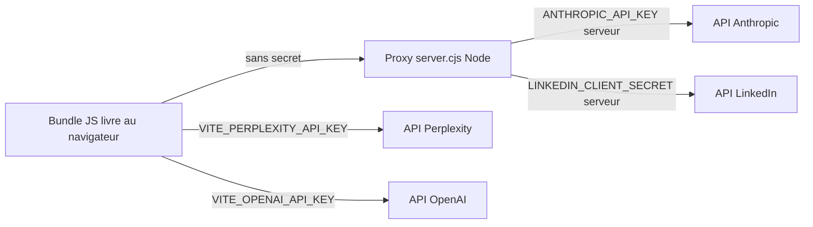
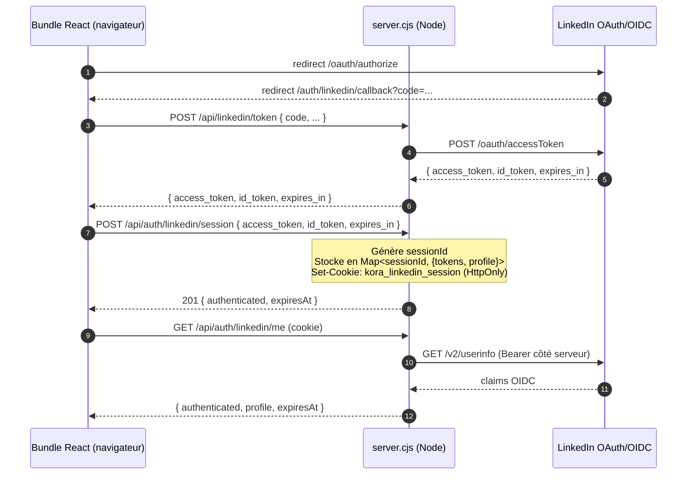

# Sécurité

Document de référence sur la sécurité de Kora Digital Pilot. Décrit le modèle de menaces, la gestion des secrets, les risques résiduels assumés et la procédure de rotation.

## 1. Modèle de menaces

Périmètre actuel : application interne déployée en local sur les postes des collaborateurs Korev AI, ou sur un serveur privé interne. Le proxy Express n'expose pas d'authentification utilisateur et n'est pas destiné à être publié sur internet en l'état.

| Menace | Exposition actuelle | Mitigation |
| --- | --- | --- |
| Fuite de clés d'API tierces (Perplexity, OpenAI) | Élevée — clés `VITE_*` embarquées dans le bundle JS livré au navigateur | Rotation régulière, plafond budgétaire chez le fournisseur, blocker anti-spam |
| Fuite du client secret LinkedIn ou de la clé Anthropic | Faible — confinés côté proxy `server.cjs` | Variables d'environnement, jamais loggées |
| Vol du token LinkedIn de l'utilisateur | Faible — tokens stockés exclusivement côté proxy, cookie httpOnly + SameSite=Lax | Cookie scoped à `/api/auth`, `Secure` en PROD, expiration alignée sur `expires_in` LinkedIn |
| Spam d'appels Perplexity (épuisement budget) | Maîtrisée | `global-api-blocker.ts`, `perplexity-protection-middleware`, plafonds quotidiens, backoff exponentiel |
| Accès non autorisé au proxy local | Faible en local, élevée si exposé en réseau | Proxy à n'exposer qu'en localhost ou réseau privé |
| Injection / XSS via contenu Perplexity rendu | Faible — données rendues via React (échappement par défaut) | Pas d'utilisation de `dangerouslySetInnerHTML` côté Perplexity |
| Exfiltration de tokens via XSS | Très faible — plus aucun token LinkedIn n'est accessible aux scripts (cookie `HttpOnly`) | CSP renforcée (`script-src 'self'`, `script-src-attr 'none'`), aucun token dans `localStorage` |

## 2. Gestion des secrets

### 2.1 Fichiers d'environnement

- `.env`, `.env.local` : fichiers locaux non versionnés (devraient figurer dans `.gitignore` — voir TECH_DEBT pour l'historique du `.env` ayant été commit).
- `.env.local.example` : gabarit versionné, à copier en `.env` ou `.env.local`. Contient uniquement des placeholders.
- Toutes les clés réelles sont configurées dans `.env` / `.env.local`, jamais dans le code source.

### 2.2 Catégorisation des clés

| Variable | Côté | Sensibilité | Commentaire |
| --- | --- | --- | --- |
| `VITE_PERPLEXITY_API_KEY` | Client (bundle) | Publique de fait | À considérer comme exposée |
| `VITE_PERPLEXITY_MODEL`, `VITE_PERPLEXITY_MAX_TOKENS`, `VITE_PERPLEXITY_TEMPERATURE` | Client | Non sensible | Paramètres |
| `VITE_OPENAI_API_KEY`, `VITE_CHATGPT_API_KEY` | Client | Publique de fait | À considérer comme exposée |
| `VITE_ANTHROPIC_API_KEY` | Client | Sensible — à supprimer | Dette : Anthropic doit passer exclusivement par le proxy |
| `VITE_LINKEDIN_CLIENT_ID` | Client | Publique par conception OAuth | OK |
| `VITE_LINKEDIN_CLIENT_SECRET` | Client | Sensible — ne doit jamais être dans `VITE_*` | Dette : à déplacer côté proxy uniquement |
| `VITE_LINKEDIN_REDIRECT_URI` | Client | Non sensible | URL de callback |

Tout secret côté proxy doit être nommé sans préfixe `VITE_` (ex. `LINKEDIN_CLIENT_SECRET`, `ANTHROPIC_API_KEY`) afin de ne pas être injecté dans le bundle.

### 2.3 Architecture des clés API

## 3. Stockage de session LinkedIn (post-migration httpOnly)

Depuis le sprint sécurité (mai 2026), les tokens LinkedIn ne sont plus persistés côté navigateur.

### 3.1 Flux d'authentification

### 3.2 Propriétés du cookie

| Attribut | Valeur | Justification |
| --- | --- | --- |
| `Name` | `kora_linkedin_session` | Préfixé pour éviter les collisions avec d'éventuels autres cookies de session |
| `HttpOnly` | toujours | Indispensable : bloque la lecture par JS et donc toute exfiltration via XSS |
| `SameSite` | `Lax` | Bloque les usages cross-site involontaires tout en autorisant le callback OAuth GET |
| `Secure` | uniquement en `PRODUCTION` | Permet le dev local en HTTP plain ; doit être systématique dès qu'on expose en HTTPS |
| `Path` | `/api/auth` | Limite l'envoi du cookie aux endpoints de session du proxy |
| `Max-Age` | `expires_in` LinkedIn | Aligne la durée de vie du cookie sur celle du token upstream |

### 3.3 Stockage côté serveur

`server.cjs` maintient une `Map<sessionId, { accessToken, idToken, expiresAtMs, profile }>` en mémoire. Le `setInterval` purge les entrées expirées chaque heure. Avantages :

- aucun jeton sur disque (pas de risque en cas d'accès lecture au filesystem) ;
- pas de DB à provisionner pour un usage local.

Limites assumées :

- **mono-instance** : un `restart` du proxy détruit toutes les sessions actives ;
- **non scalable horizontalement** : pour un déploiement multi-instances il faudra remplacer ce store par un backend partagé (Redis, KMS-encrypted disk, etc.).

### 3.4 Lifecycle

- **Création** : `POST /api/auth/linkedin/session` (201)
- **Lecture profil** : `GET /api/auth/linkedin/me` — fetch LinkedIn lazy, profil mis en cache dans la session après le premier appel
- **Invalidation** : `POST /api/auth/linkedin/logout` (204) — purge la session côté serveur et `Set-Cookie` avec `Max-Age=0`
- **Expiration upstream** : tout retour `401` de l'API LinkedIn provoque la destruction de la session locale et la purge du cookie

## 4. Risques résiduels assumés

Ces points sont connus et listés ici pour transparence. Ils figurent également dans `TECH_DEBT.md` avec une trajectoire de remédiation.

1. **Sessions LinkedIn en mémoire mono-instance.** Acceptable pour un déploiement local. Remédiation cible : Redis ou store chiffré disque dès qu'on scale horizontalement.
2. **Pas d'authentification applicative sur le proxy local.** Tout processus pouvant atteindre `localhost:3001` peut appeler les endpoints. Acceptable en usage local ; à durcir en cas de déploiement (mTLS, JWT serveur-à-serveur).
3. **Clés `VITE_*` exposées au bundle.** Documenté en section 2. Acceptable pour Perplexity / OpenAI avec rotation et plafond budgétaire ; pas acceptable pour LinkedIn `CLIENT_SECRET` ni Anthropic — roadmap : faire transiter ces appels via le proxy avec secret côté serveur uniquement.
4. **`'unsafe-inline'` toléré dans `style-src`.** Nécessaire à Radix/shadcn pour le positionnement dynamique (popovers, tooltips). À retirer après audit du DOM si remplacement possible par classes Tailwind.
5. **Pas de chiffrement applicatif du `localStorage`.** Données planning / historique en clair. Risque limité tant que l'accès au poste est contrôlé.
6. **Historique git** : patterns `git filter-repo` prêts dans `scripts/filter-repo-patterns.txt`, exécution déléguée au coordinator après rotation des clés. Voir `docs/audit/SECURITY_REMEDIATION_REPORT.md` §5.
7. **Aucune révocation upstream LinkedIn lors du logout.** Le cookie est invalidé côté serveur et le client n'a plus rien, mais le token reste actif chez LinkedIn jusqu'à `expires_in`. Roadmap : ajouter un appel `revoke` LinkedIn.

## 5. Protections en place

- **Blocker global anti-spam** (`src/lib/global-api-blocker.ts`) : interception et plafonnement des appels API.
- **Détection d'état serveur** (`src/lib/server-detection.ts`) : arrêt automatique des tentatives après détection d'incident.
- **Middleware Perplexity** (`src/lib/perplexity-protection-middleware.ts`) : limites configurables (appels par minute / par heure, plafond budgétaire quotidien), historisation locale, reset manuel.
- **Backoff exponentiel et déduplication** sur les hooks `useLinkedInAnalytics`, `usePerplexity`, `useBusinessIntelligence`.
- **Rate limiting proxy** (`server.cjs`) : fenêtres glissantes par endpoint (`/api/auth/linkedin/session` : 30/min, `/api/auth/linkedin/me` : 120/min, `/api/auth/linkedin/logout` : 60/min, plus le limiteur global 300/min sur `/api/*`).
- **`trust proxy` activé** : `req.ip` reflète le client réel derrière le proxy Vite ou un reverse proxy, évitant le contournement du rate-limit par triangulation.
- **Logger structuré** dans tous les environnements : `method path status ip durationMs`, JSON-shape en PRODUCTION, jamais de body ni de token.
- **CSP** : `default-src 'self'`, `script-src 'self'`, `script-src-attr 'none'`, `frame-ancestors 'none'`, `connect-src` limité aux upstreams côté serveur.
- **Helmet HSTS** activé en `PRODUCTION`.
- **Validation d'entrée** : Zod côté formulaires sensibles, sanitisation des noms de marque avant requête Perplexity.

## 6. Procédure de rotation des clés

À exécuter au minimum trimestriellement et immédiatement en cas de suspicion de fuite.

1. Générer une nouvelle clé chez le fournisseur (Perplexity, OpenAI, Anthropic, LinkedIn).
2. Mettre à jour la valeur dans `.env` ou `.env.local` selon la machine concernée.
3. Pour les clés côté proxy (Anthropic, LinkedIn `CLIENT_SECRET`), redémarrer `server.cjs`.
4. Pour les clés côté bundle (`VITE_*`), reconstruire l'application : `npm run build`.
5. Révoquer l'ancienne clé chez le fournisseur.
6. Inspecter les logs du fournisseur sur les sept jours précédents à la recherche d'usage anormal.
7. Si une clé a été commit en clair dans l'historique git, réécrire l'historique (`git filter-repo`) et procéder à un force push coordonné avec l'équipe.

## 7. Signalement d'une vulnérabilité

Toute découverte de vulnérabilité doit être adressée à `security@korev.ai` (placeholder, à ajuster). Pas de divulgation publique avant correction.

## 8. Statut post-Agent 1 (Wave 1)

- ✅ Scan secrets résiduels dans le tree : 0 match (cf. `docs/audit/SECURITY_REMEDIATION_REPORT.md` §2).
- ✅ Migration tokens LinkedIn vers cookie `HttpOnly` : effective (cf. §3).
- ✅ Bump `jspdf` 3.0.1 → 4.2.1 : 1 critical + 4 high CVEs résolues. 9 moderate restantes côté `devDependencies` (vitest 2.x), à traiter par Agent 2.
- ✅ Durcissement proxy : `trust proxy`, logger structuré, CSP renforcée, `cookie-parser` monté.
- 🟡 Purge historique git : patterns prêts (`scripts/filter-repo-patterns.txt`), exécution déléguée au coordinator après rotation des 4 clés providers.
- 🟡 Rotation effective des clés : à effectuer par l'utilisateur dans les consoles fournisseur.

---

Dernière mise à jour : 2026-05-22 (Agent 1 — Wave 1).
